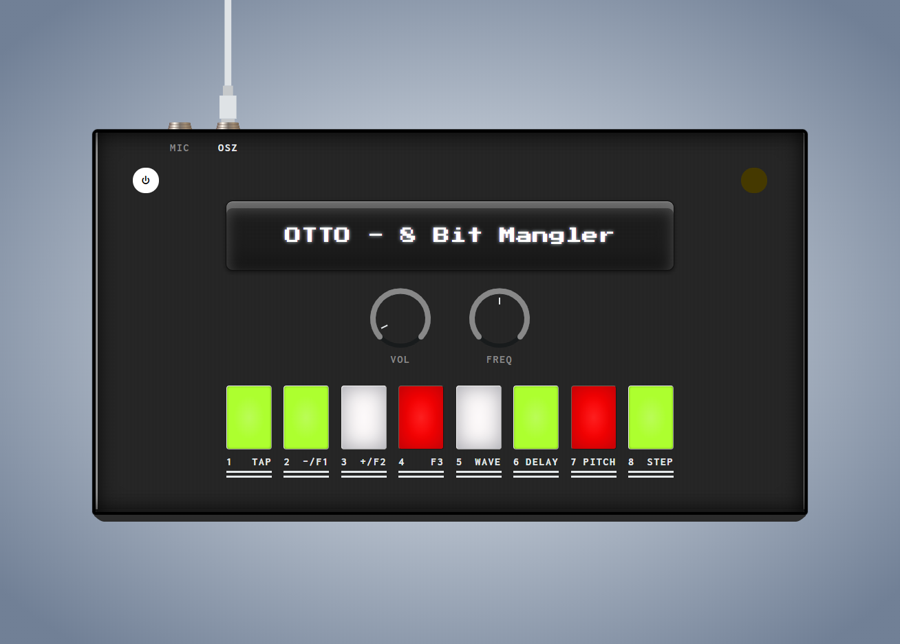

## OTTO



Check it out live: https://otto.leimstaedtner.it

You can even plug-in your MIDI-controller and use it on stage - all assets are chached offline!


### Development

* Start a local https server
  * E.g. with ruby:
  ```ruby
  ruby -r webrick/https -e 'WEBrick::HTTPServer.new(Port: 8000, DocumentRoot: ".", SSLEnable: true, SSLCertName: [%w[CN localhost]]).start'
  ```
* Open https://localhost:8000/ or https://otto.lvh.me:8000/
* When done, commit your changes and sync to the SFTP server.