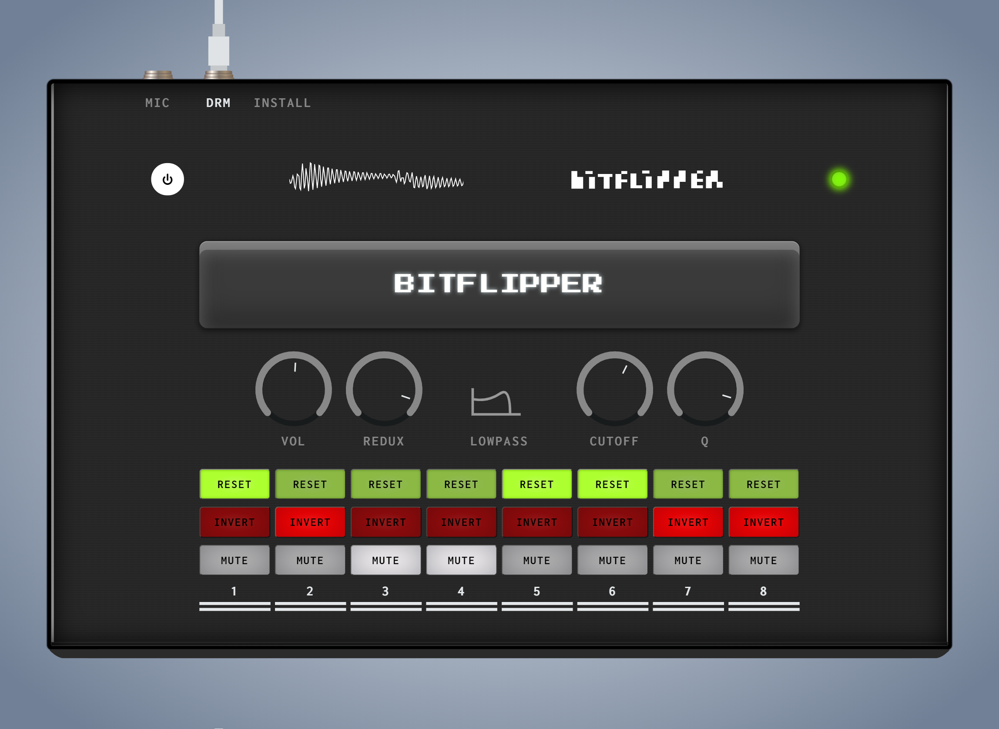

## BITFLIPPER



Bitflipper is a little effects-box built using modern web techniques like WebAudio's AudioWorklet. It's main functionallity is the bit-wise control over the sound input using the colored buttons - hence the name. 

Check it out live: https://bitflipper.leimstaedtner.it

You can even plug-in your MIDI-controller and use it on stage - all assets are chached offline!

Currently, [only a few Browsers](https://caniuse.com/#search=AudioWorklet) support AudioWorklets. I recommend using Chrome for now.


### Development

* Start a local https server
  * E.g. with ruby:
  ```ruby
  ruby -r webrick/https -e 'WEBrick::HTTPServer.new(Port: 8000, DocumentRoot: ".", SSLEnable: true, SSLCertName: [%w[CN localhost]]).start'
  ```
* Open https://localhost:8000/ or https://bitflipper.lvh.me:8000/
* Your code will be synced to production once merged into `master`.

### Further ideas
  * Controls for the bit depth. It is currently static at 8, allowed values are [1..16]
  * The overall volume is limited through a `DynamicsCompressor` to avoid an overly loud output. A toggle button could be introduced to disable this limiter.
  * Currently, the default input and output device are automatically selected. We could give the user more control on the audio input/output.
  * We could design another cable that resembles the audio output